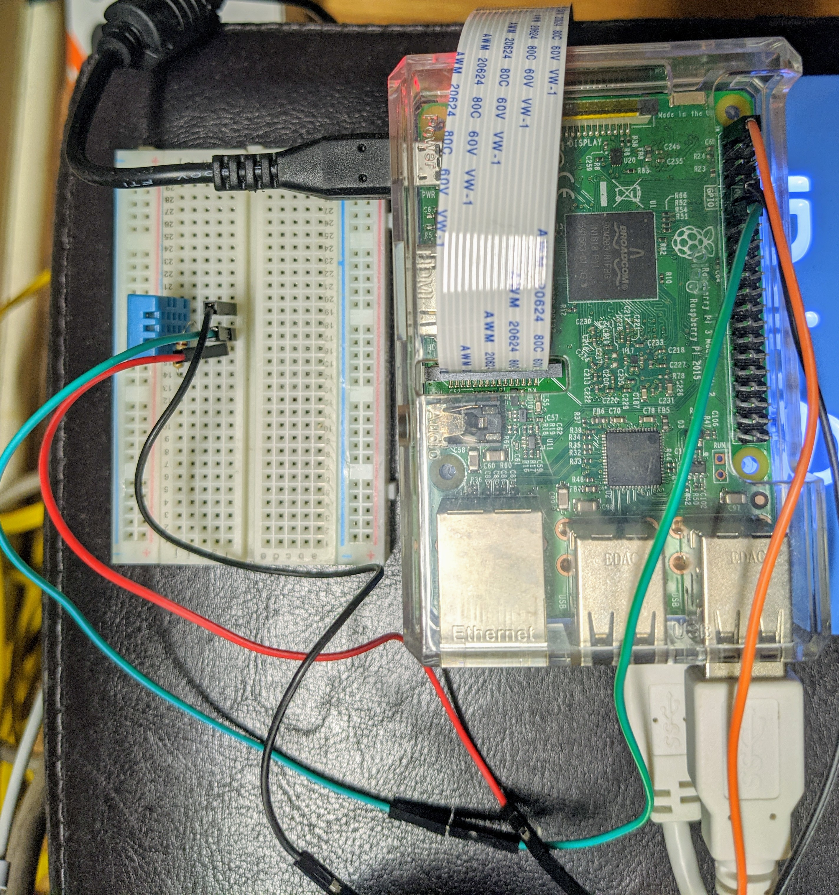

# tempsense
This project collects room temperature and humidity from a DHT11 sensor that is wired to a raspberry PI. The data gathered from
sensor is written to a CSV file with the intention of using it for predicting room temperature and humidity just by giving outside
temparature and humidity.

### Circuit

* Red/orange wire is connected to pin 1 of pi and pin 1 of sensor which is supplying power to the sensor.
* Green wire is used between pin 2 of sensor and pin 10 (GPIO 17) of raspbeery PI and its for transferring sensor data.
* A 10 kOhm resistor is placed between pins 1 and 2 of the sensor which acts as a pull-up resistor.
* Black wire is used to connect pin 4 of sensor and pin 9 of raspberry pi.

### Resources
* [Temp Sensor Usage](https://www.raspberrypi-spy.co.uk/2017/09/dht11-temperature-and-humidity-sensor-raspberry-pi/)
* [Good Tutorial on sensor Usage](https://medium.com/initial-state/how-to-build-a-raspberry-pi-temperature-monitor-8c2f70acaea9)
* [Mounting External Drive](https://www.raspberrypi.org/documentation/configuration/external-storage.md)
* [pyenv github](https://github.com/pyenv/pyenv)
* [pyenv virtualenv plugin](https://github.com/pyenv/pyenv-virtualenv)
* [Python project structure for datascience](https://drivendata.github.io/cookiecutter-data-science/)
* [Another python datascience structure](https://towardsdatascience.com/structure-your-data-science-projects-6c6c8653c16a)
